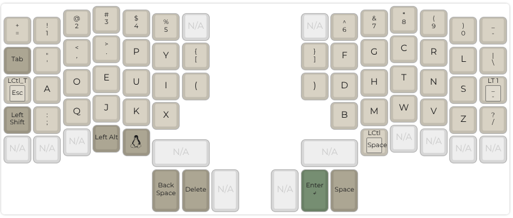
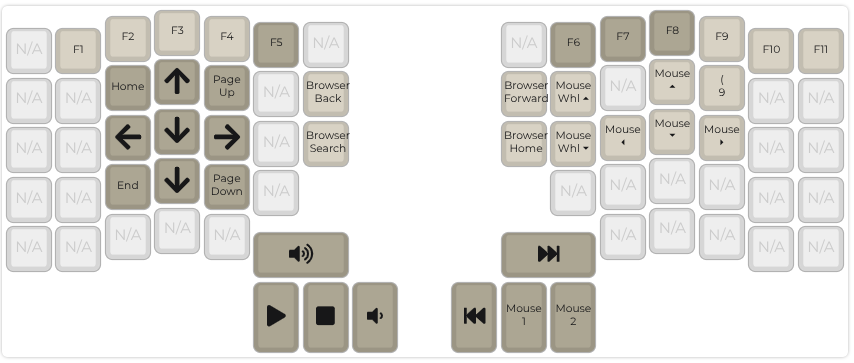

# qmk-keymap

[](https://github.com/ianlewis/ergodox_keymap/actions/workflows/pre-submit.units.yml) [](https://api.securityscorecards.dev/projects/github.com/ianlewis/ergodox_keymap)

This repository contains my [Quantum Mechanical Keyboard](https://docs.qmk.fm/) keymaps for [ZSA Ergodox EZ](keyboards/ergodox_ez/keymaps/ianlewis_dvorak) and [ZSA Moonlander](keyboards/zsa/moonlander/keymaps/ianlewis_dvorak).

## Keymap

This is a visualization of the keymap. No special QMK features are used currently.

### Base Layer

The base layer is based on a Dvorak keyboard layout which corresponds to a U.S. English keyboard map in software. Modifiers are located on the edge of the keyboard and accessed with the right and left pinky finger.



### Navigation/Media Layer

The media layer includes media keys and navigation keys. It is used by holding down the layer key with the right pinky.



## Installation

The repository requires the Python runtime to be installed. The [Makefile](./Makefile) defines various targets.

```shell
$ make
qmk-keymap Makefile
Usage: make [COMMAND]

  help                 Shows all targets and help from the Makefile (this message).
Build
  ergodox_ez-compile   Compile Ergodox EZ firmware
  ergodox_ez-flash     Flash Ergodox EZ firmware
  moonlander-compile   Compile ZSA Moonlander firmware
  moonlander-flash     Flash ZSA Moonlander firmware
Tools
  license-headers      Update license headers.
Formatting
  format               Format all files
  clang-format         Format C files.
  md-format            Format Markdown files.
  yaml-format          Format YAML files.
Linting
  lint                 Run all linters.
  actionlint           Runs the actionlint linter.
  zizmor               Runs the zizmor linter.
  markdownlint         Runs the markdownlint linter.
  textlint             Runs the textlint linter.
  yamllint             Runs the yamllint linter.
Maintenance
  clean                Delete temporary files.
```

The keymaps can be compiled and flashed with the following commands. You will need to set up Linux [udev rules](https://docs.qmk.fm/faq_build#linux-udev-rules) before this will work.

```shell
# ZSA Ergodox EZ
make ergodox_ez-flash

# ZSA Moonlander
make moonlander-flash
```
