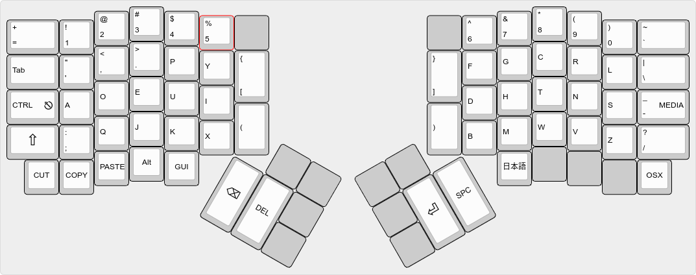
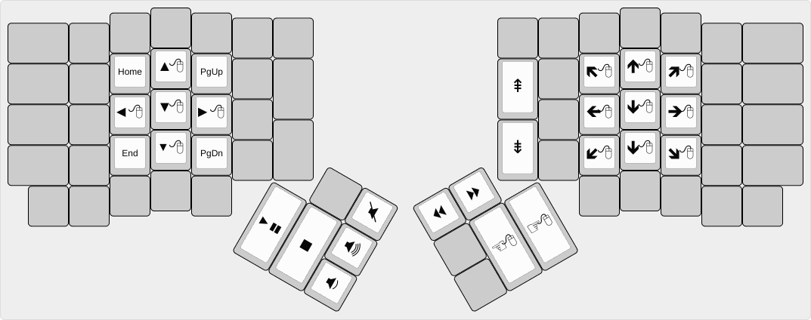
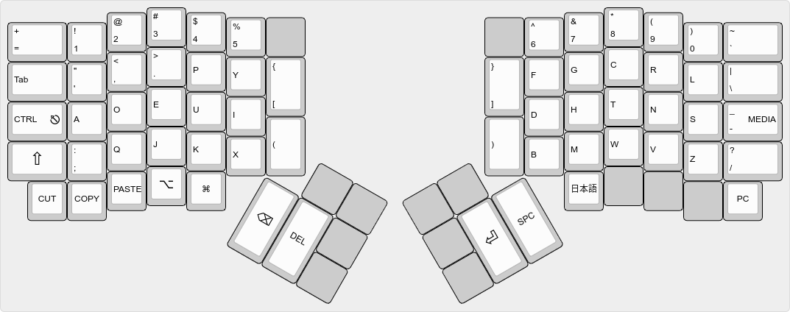
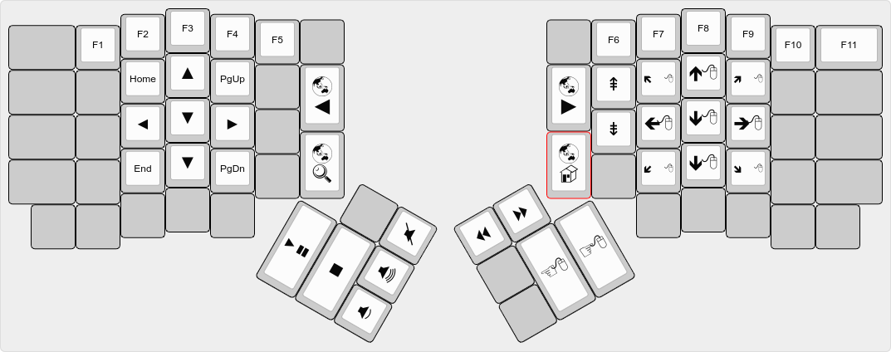

# ergodox\_keymap

[](https://app.wercker.com/project/byKey/b813324efc29cca64167be95b620c71c)
[  ](https://bintray.com/ianlewis/ergodox\_layout/ergodox.hex/\_latestVersion)

My Ergodox Keyboard Layout

The Keyboard is defined in a Dvorak keyboard layout which corresponds to a U.S. English
keyboard map in software.

# Layers

The keyboard layout is organized in four layers. Two main layers for PC and Mac
and two supporting layers for media keys for PC and Mac.

*Images are created using the [Keyboard Layout Editor](http://www.keyboard-layout-editor.com/)*

## PC (Base) Layer



## PC Media Layer



## Mac OSX Layer



## Mac OSX Media Layer



# Build

To build the keymap you need to first download the
[qmk\_firmware](https://github.com/jackhumbert/qmk_firmware/) and
create a link to this repository.

```shell
$ git clone https://github.com/jackhumbert/qmk_firmware.git
$ cd qmk_firmware
$ ln -s /path/to/ergodox_layout keyboards/ergodox/keymaps/mykeymap
```

Then you can build the keymap hex file.

```shell
$ make keyboard=ergodox keymap=mykeymap
```

# Flashing

Make sure you have the
[teensy\_loader\_cli](http://www.pjrc.com/teensy/loader_cli.html) installed.
Then you can flash to the Ergodox Ez on USB. Run this command and hit
the reset button on the Ergodox Ez.

```shell
$ teensy_loader_cli -mmcu=atmega32u4 -w -v mykeymap.hex
```

If you have the teensy\_loader\_cli installed, you can also build and flash the
keymap in one step.

```shell
$ make teensy keyboard=ergodox keymap=mykeymap
```
