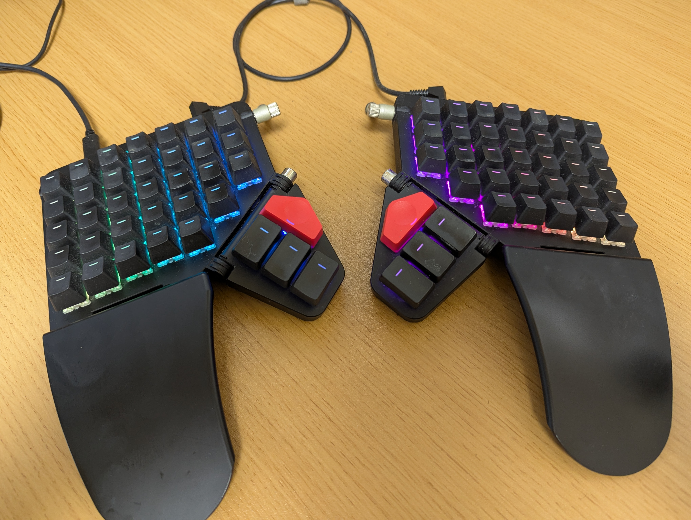

# ZSA Moonlander ianlewis_dvorak keymap

My [ZSA Moonlander](https://www.zsa.io/moonlander) keymap.

## Base Layer

The base layer is based on a Dvorak keyboard layout which corresponds to a U.S. English keyboard map in software. Modifiers are located on the edge of the keyboard and accessed with the right and left pinky finger.

## Navigation/Media Layer

The media layer includes media keys and navigation keys. It is used by holding down the layer key with the right pinky.

